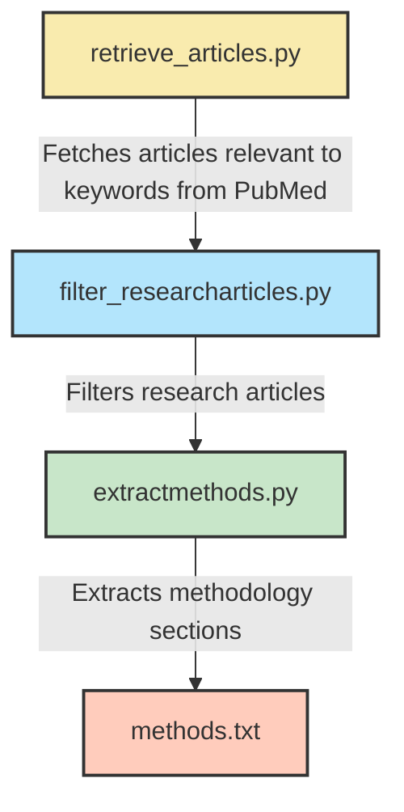

# LitExtract

This repository contains scripts for automated literature retrieval, data extraction, and visualization of preprocessing trends in mobile EEG research.
It supports the analysis conducted for the paper:
“Preprocessing on the Move: An Overview of Preprocessing Pipelines in Gait-related Mobile EEG”

## Installation

Use poetry for dependency management and environment setup

## Suggested workflow
The [`scripts`](scripts) folder contains codes to retreive and filter articles from PubMed, extract the methods section as .txt files and store them in your local PC for data extraction. These files can be parsed for parameters of interest using Elicit Pro, an AI literature review tool. The workflow to download articles is as follows,

## Prompting
To extract parameters from selected articles in Elicit Pro, the prompts are saved in [`utils/prompts.txt`](utils/prompts.txt)

## Data cleaning and preprocessing
Once the data from Elicit is extracted and doenloaded as a CSV file, the output is checked manually for errors and inconsistencies. The reviewed file is present in [`data`](data) folder. 
In order to further clean and obtain distinct dataframes, use, [`scripts/clean_elicitdatacsv.py`](scripts/clean_elicitdatacsv.py)

This script:
- Standardizes column names and formats
- Applies the split_and_clean() function from utils/cleandata.py
- Prevents unintended row loss by uniquely identifying similar citations
- Produces three cleaned CSVs:
  - [`data//cleancsv/Artifact_Methods_cleaned.csv`](data//cleancsv/Artifact_Methods_cleaned.csv)
  - [`data//cleancsv/Step_Keywords_cleaned.csv`](data//cleancsv/Step_Keywords_cleaned.csv)
  - [`data//cleancsv/Outcome_Keywords_cleaned.csv`](data//cleancsv/Outcome_Keywords_cleaned.csv)
These cleaned datasets form the analytical basis for the subsequent visualizations.

## Data visualization
The scripts to generate data visualization plots in the manuscript can be found in the [`scripts`](scripts) folder and the generated plots are present in the [`plots`](plots) folder.

## Authors
- v.vinod@neurologie.uni-kiel.de
- j.welzel@neurologie.uni-kiel.de
